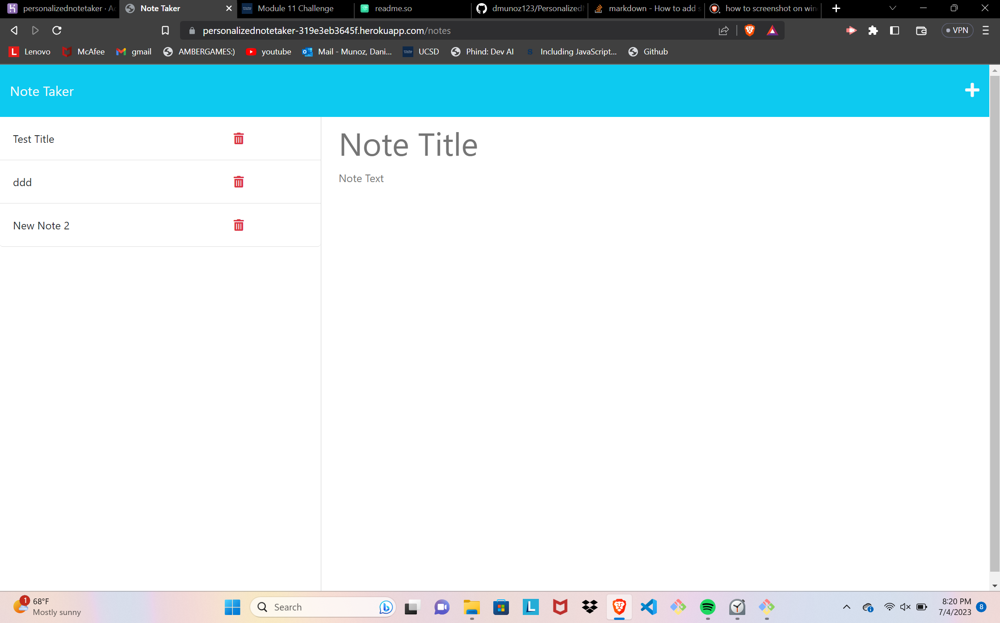

# Personalized Note Taker

This project assists users with keeping track of their day. Upon installation, the user is presented with a clean and neat UI wherein they can write notes/reminders for their day. Users even have the ability to save data for their next session. App completed using Express.js 

## Authors

- [@dmunoz123](https://github.com/dmunoz123)


## Installation

Install my-project with npm, the project will be ran completely on Heroku, a cloud platform service.

```bash
  npm install
```

## Packages

Read documentation regarding each package used in this project:
- [Heroku](https://devcenter.heroku.com/categories/reference)
- [Express.js](https://expressjs.com/)
- [UUID](https://www.npmjs.com/package/uuid)

## Example

- 
- [Heroku Deployment](https://personalizednotetaker-319e3eb3645f.herokuapp.com/)
- [Github](https://github.com/dmunoz123/PersonalizedNoteTaker)
